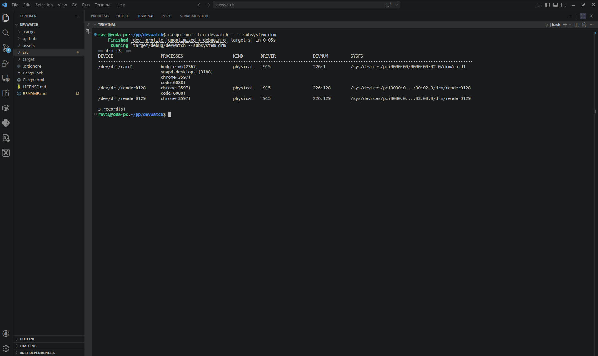

<p align="left">
  
</p>

# devwatch

**devwatch** is a lightweight Linux device observability tool written in Rust.

**Think: `lsof` + `htop`, but for Linux devices**

## 🧠 Why devwatch?

Linux provides excellent tools for observing systems:

- Processes → `top`, `htop`  
- Files → `lsof`  

But there is no simple way to answer:

- Which process is using my GPU?
- Who opened `/dev/video0`?
- Which application is interacting with hardware devices?

**devwatch fills this gap.**

It bridges:

- `/proc` → processes  
- `/dev` → device nodes  
- `/sys` → kernel metadata (drivers, subsystems)  

- By default, `devwatch` shows devices currently opened by processes.
- Use `--all-devices` to inspect all discoverable `/dev` device nodes.
- So you can clearly understand how software interacts with hardware and kernel subsystems in real time.

---

## ✨ Features

- Process → device mapping via `/proc`
- `/dev` → `/sys` resolution using device numbers
- Subsystem detection (e.g., `drm`, `input`, `sound`)
- Driver detection with parent traversal
- Device classification:
  - `physical`
  - `virtual`
  - `pseudo`
- Cross-platform support:
  - x86 Linux
  - Raspberry Pi
  - Embedded Linux platforms (MPSoC, i.MX, etc.)

---

## 🖥️ Example Output

```bash
== drm (3) ==
DEVICE                   PROCESSES                    KIND       DRIVER           DEVNUM         SYSFS
------------------------------------------------------------------------------------------------------------------------
/dev/dri/card1           chrome(3597) [468.2 MB]      physical   i915             226:1          /sys/class/drm/card1
                         code(6088) [241.7 MB]

/dev/dri/renderD128      chrome(3597) [468.2 MB]      physical   i915             226:128        /sys/class/drm/renderD128
                         code(6088) [241.7 MB]
```

## 📸 Screenshots

### CLI Output



### JSON Output


## 🏗️ Project Structure

```bash
src/
├── lib.rs               # Library entry
├── model.rs             # Shared data structures
├── procfs_layer.rs      # Process + FD discovery
├── dev_layer.rs         # /dev extraction & grouping
├── sysfs_layer.rs       # /dev -> /sys resolution
└── bin/
    └── devwatch.rs      # CLI entry point
```


---

## 🔧 Build

### Native build (x86_64)

```bash
cargo build --release
cargo run --bin devwatch
```

### Cross compile (ARM64)

```bash
cargo build --release --target aarch64-unknown-linux-gnu --bin devwatch
```

## 🚀 Install

### From source

```bash
git clone https://github.com/ravikiranbvn/devwatch
cd devwatch
cargo build --release
./target/release/devwatch
```

### Prebuilt binaries

Download from GitHub Releases:

```bash
https://github.com/ravikiranbvn/devwatch/releases
tar -xzf devwatch-linux-x86_64.tar.gz
cd devwatch-linux-x86_64
./devwatch
```

## Usage

# Default view (grouped by subsystem)
devwatch

# Filter by subsystem
devwatch --subsystem drm

# Filter by driver
devwatch --driver i915

# Filter by device name
devwatch --device video

# Show all devices (not just active ones)
devwatch --all-devices

# JSON output
devwatch --json

# Count only
devwatch --count-only

---

🎯 Use Cases
- Debugging device access conflicts (e.g., camera, GPU)
- Understanding hardware usage by applications
- Inspecting device behavior on embedded Linux systems
- Exploring Linux internals (/proc, /dev, /sys) in a unified view

---

🤝 Contributing

Feedback, issues, and pull requests are welcome.

Open an issue for bugs or feature requests
Submit a PR for improvements