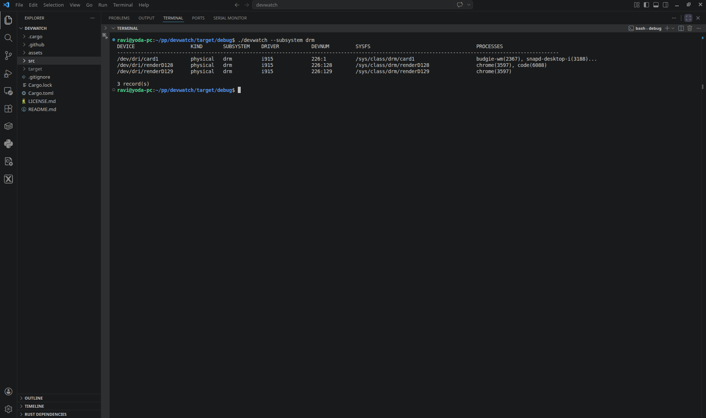
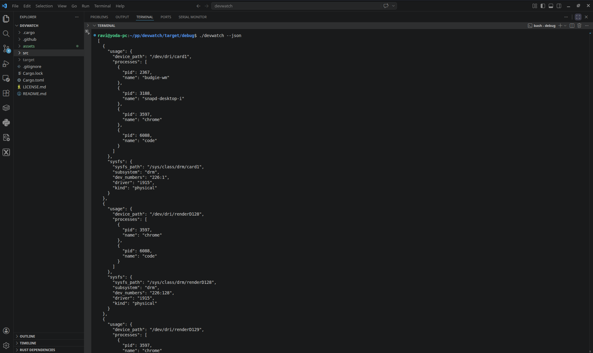

<p align="left">
  
</p>

# devwatch

**devwatch** is a lightweight Linux device observability tool written in Rust.

**Think: `lsof` + `htop`, but for Linux devices**

## 🧠 Why devwatch?

Linux provides excellent tools for observing systems:

- Processes → `top`, `htop`  
- Files → `lsof`  

But there is no simple way to answer:

- Which process is using my GPU?
- Who opened `/dev/video0`?
- Which application is interacting with hardware devices?

**devwatch fills this gap.**

It bridges:

- `/proc` → processes  
- `/dev` → device nodes  
- `/sys` → kernel metadata (drivers, subsystems)  

So you can clearly understand how software interacts with hardware and kernel subsystems in real time.

---

## ✨ Features

- Process → device mapping via `/proc`
- `/dev` → `/sys` resolution using device numbers
- Subsystem detection (e.g., `drm`, `input`, `sound`)
- Driver detection with parent traversal
- Device classification:
  - `physical`
  - `virtual`
  - `pseudo`
- Cross-platform support:
  - x86 Linux
  - Raspberry Pi
  - Embedded Linux platforms (MPSoC, i.MX, etc.)

---

## 🖥️ Example Output

```bash
DEVICE                   KIND       SUBSYSTEM    DRIVER           DEVNUM         SYSFS                                    PROCESSES
------------------------------------------------------------------------------------------------------------------------------------------------------
/dev/dri/card1           physical   drm          i915             226:1          /sys/class/drm/card1                     chrome(3638), code(4909)
/dev/input/event0        physical   input        unknown          13:64          /sys/class/input/event0                  wayfire(966)
/dev/fuse                virtual    misc         unknown          10:229         /sys/class/misc/fuse                     gvfsd-fuse(1285)
```

## 📸 Screenshots

### CLI Output



### JSON Output



## 🏗️ Project Structure

```bash
src/
├── lib.rs               # Library entry
├── model.rs             # Shared data structures
├── procfs_layer.rs      # Process + FD discovery
├── dev_layer.rs         # /dev extraction & grouping
├── sysfs_layer.rs       # /dev -> /sys resolution
└── bin/
    └── devwatch.rs      # CLI entry point
```


---

## 🔧 Build

### Native build (x86_64)

```bash
cargo build --release
cargo run --bin devwatch
```

### Cross compile (ARM64)

```bash
cargo build --release --target aarch64-unknown-linux-gnu --bin devwatch
```

## Usage

```bash
devwatch
devwatch --json
devwatch --device video
devwatch --subsystem drm
devwatch --driver i915
```

---

🎯 Use Cases
- Debugging device access conflicts (e.g., camera, GPU)
- Understanding hardware usage by applications
- Inspecting device behavior on embedded Linux systems
- Exploring Linux internals (/proc, /dev, /sys) in a unified view

---